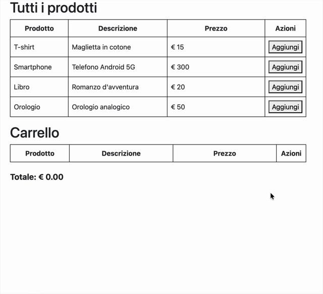

# Carrello della spesa

Vogliamo ottenere la seguente pagina:

L'esercizio è molto simile a quello precedente e possiamo prendere spunto da quello. In questo caso abbiamo la classe `library.js ` che contiene due classi:

* `Product`: una classe che rappresenta un singolo prodotto
* `ProductList`: una classe che avrà al suo interno una lista di `Product` e avrà i metodi:
  * `addProduct`: metodo che aggiunge un prodotto
  * `removeProduct`: metodo che rimuove un prodotto
  * `sumProducts`: metodo che calcola il costo totale dei prodotti

Nel file `script.js` **questa volta avremo due istanze di `ProductList`**, una per tenere tutti i prodotti e una per il carrello. La prima istanza verrà caricata all'avvio della pagina con tutti i prodotti mentre alla seconda verranno aggiunti o rimossi i prodotti dall'utente.

## Punteggio

* Classe `Product`: 1 punto
* Classe `ProductList`: 2 punti
* JS tabella con i prodotti: 1 punto
* JS aggiunta al carrello: 1 punto
* JS rimozione dal carrello: 1 punto
* Totale: 1 punto
* JS disegno pagina: 1 punto
* CSS: 1 punto
* Popup: 1 punto

### Penalità

* codice non formattato: -0.5
* classe con nome che comincia con lettera minuscola: -0.5
* variabile/attributo/funzione/metodo con nome che comincia con lettera maiuscola: -0.5
* nome singolare per definire una collezione o nome plurale per indicare un elemento singolo: -0.5